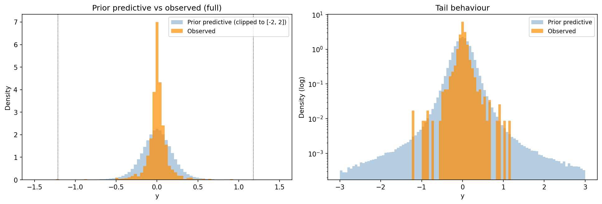
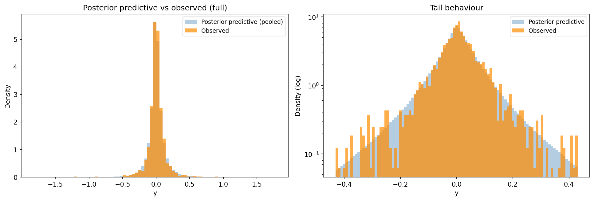
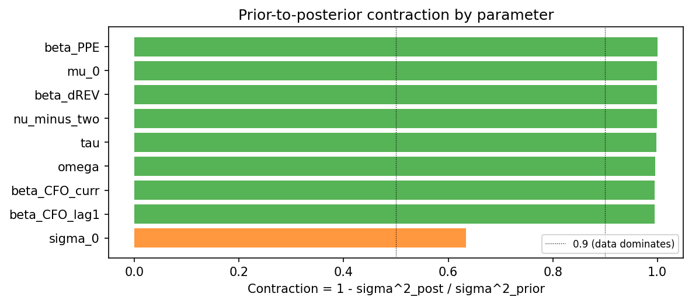
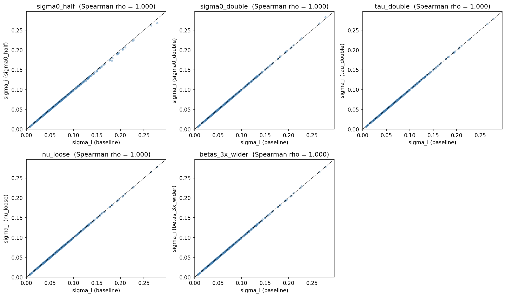

# HB accrual model -- diagnostics, portfolio year 2010

- **input_csv**: results/extraction_static/prepared_step2_input.csv
- **portfolio_year**: 2010
- **n_firms_in_window**: 329
- **n_obs_in_window**: 1909
- **window_years**: 2005-2010
- **n_draws**: 2000
- **n_tune**: 4000
- **n_chains**: 4
- **sensitivity_grid**: basic
- **n_variants**: 6

## 1. Prior predictive check

Sampled observable values from the prior alone and compared to observed data.

| Statistic | Observed | Prior predictive |
|---|---|---|
| Min / Max | -1.213 / +1.179 | -- |
| Quantile 0.01% / 99.99% | -- | -5.662 / +5.942 |
| Quantile 2.5% / 97.5% | -0.277 / +0.284 | -0.424 / +0.433 |
| Std deviation | 0.144 | 0.289 |

Fraction of prior-predictive draws within the observed range: **99.6%**.  
Fraction with |y| > 1: **0.6%**.

## 2. Posterior predictive check

Sampled observable values from the posterior and compared to observed data. Bayesian p-values close to 0.5 indicate the model captures the corresponding test statistic; values near 0 or 1 indicate misfit.

| Statistic | Observed | Posterior pred. mean | Bayesian p |
|---|---|---|---|
| mean | +0.0076 | +0.0057 | 0.303 |
| std | +0.1435 | +0.1592 | 0.821 |
| skew | -0.0914 | +0.0597 | 0.562 |
| kurtosis | +17.3382 | +55.1763 | 0.716 |
| min | -1.2128 | -1.7800 | 0.300 |
| max | +1.1790 | +1.7822 | 0.754 |
| q05 | -0.1757 | -0.1952 | 0.054 |
| q95 | +0.1919 | +0.2101 | 0.925 |

_Based on 8000 posterior predictive replicates of 1909 observations each._

## 3. Prior-to-posterior contraction

Contraction = 1 - sigma^2_post / sigma^2_prior. Values near 1 mean the data dominated; values near 0 mean the prior dominated.

| parameter | prior_dist | prior_sd | posterior_mean | posterior_sd | contraction |
|---|---|---|---|---|---|
| beta_PPE | Normal | 0.3000 | -0.0015 | 0.0020 | 1.0000 |
| mu_0 | Normal | 0.1000 | 0.0010 | 0.0025 | 0.9994 |
| beta_dREV | Normal | 0.3000 | 0.1015 | 0.0079 | 0.9993 |
| nu_minus_two | Exponential | 10.0000 | 1.2077 | 0.3540 | 0.9987 |
| tau | HalfNormal | 0.0301 | 0.0025 | 0.0014 | 0.9977 |
| omega | HalfNormal | 0.0301 | 0.0026 | 0.0018 | 0.9964 |
| beta_CFO_curr | Normal | 0.3000 | -0.2679 | 0.0220 | 0.9946 |
| beta_CFO_lag1 | Normal | 0.3000 | 0.2472 | 0.0225 | 0.9944 |
| sigma_0 | HalfNormal | 0.0301 | 0.0921 | 0.0182 | 0.6344 |

## 4. Sensitivity to alternative priors

Comparison of posterior mean of the target quantity across prior variants.

### Pairwise summary (vs baseline)

| variant | vs_baseline | median_abs_diff | p95_abs_diff | median_rel_diff_pct | p95_rel_diff_pct | spearman_rho |
|---|---|---|---|---|---|---|
| sigma0_half | baseline | 0.0004 | 0.0029 | 0.6844 | 1.7828 | 0.9999 |
| sigma0_double | baseline | 0.0002 | 0.0012 | 0.3892 | 1.0607 | 0.9999 |
| tau_double | baseline | 0.0002 | 0.0007 | 0.3203 | 0.9356 | 0.9999 |
| nu_loose | baseline | 0.0002 | 0.0007 | 0.2906 | 0.9044 | 0.9999 |
| betas_3x_wider | baseline | 0.0002 | 0.0008 | 0.3395 | 1.1100 | 0.9999 |

### Rank correlations

|  | baseline | sigma0_half | sigma0_double | tau_double | nu_loose | betas_3x_wider |
|---|---|---|---|---|---|---|
| baseline | 1.0000 | 0.9999 | 0.9999 | 0.9999 | 0.9999 | 0.9999 |
| sigma0_half | 0.9999 | 1.0000 | 0.9999 | 0.9999 | 0.9999 | 0.9999 |
| sigma0_double | 0.9999 | 0.9999 | 1.0000 | 0.9999 | 0.9999 | 0.9999 |
| tau_double | 0.9999 | 0.9999 | 0.9999 | 1.0000 | 0.9999 | 0.9999 |
| nu_loose | 0.9999 | 0.9999 | 0.9999 | 0.9999 | 1.0000 | 0.9999 |
| betas_3x_wider | 0.9999 | 0.9999 | 0.9999 | 0.9999 | 0.9999 | 1.0000 |

