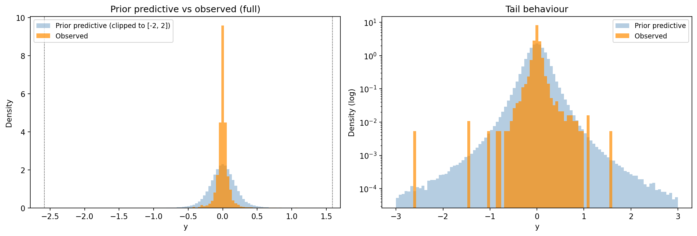
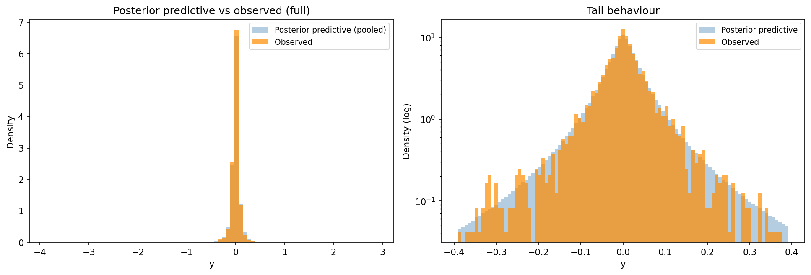
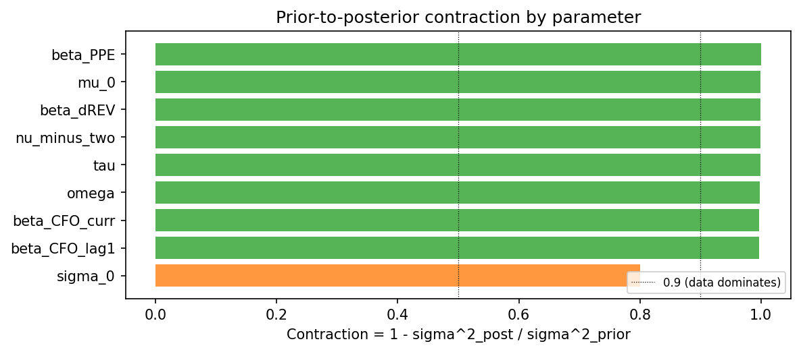
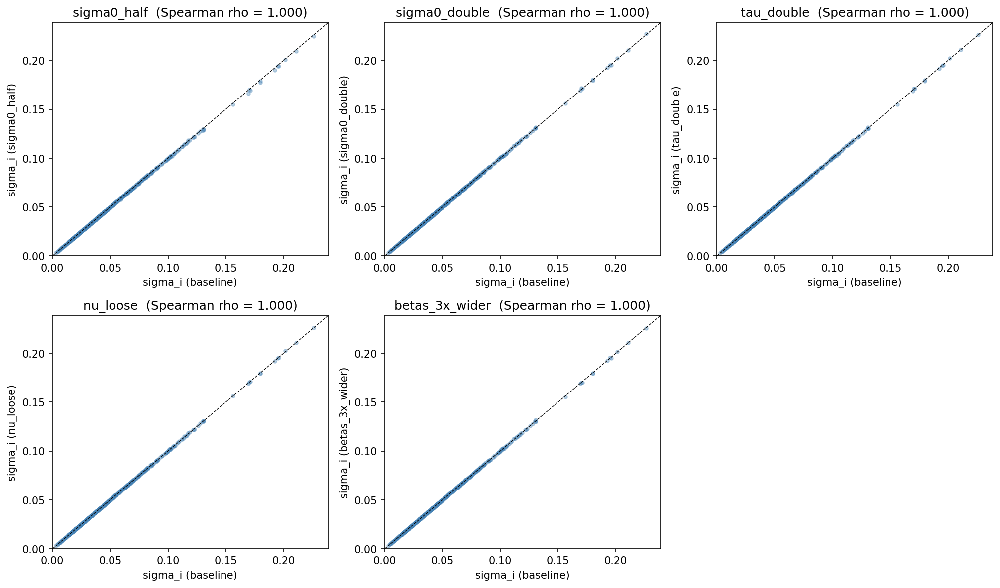

# HB accrual model -- diagnostics, portfolio year 2020

- **input_csv**: results/extraction_static/prepared_step2_input.csv
- **portfolio_year**: 2020
- **n_firms_in_window**: 529
- **n_obs_in_window**: 3107
- **window_years**: 2015-2020
- **n_draws**: 2000
- **n_tune**: 4000
- **n_chains**: 4
- **sensitivity_grid**: basic
- **n_variants**: 6

## 1. Prior predictive check

Sampled observable values from the prior alone and compared to observed data.

| Statistic | Observed | Prior predictive |
|---|---|---|
| Min / Max | -2.580 / +1.591 | -- |
| Quantile 0.01% / 99.99% | -- | -2.345 / +2.354 |
| Quantile 2.5% / 97.5% | -0.209 / +0.204 | -0.420 / +0.428 |
| Std deviation | 0.130 | 0.222 |

Fraction of prior-predictive draws within the observed range: **100.0%**.  
Fraction with |y| > 1: **0.3%**.

## 2. Posterior predictive check

Sampled observable values from the posterior and compared to observed data. Bayesian p-values close to 0.5 indicate the model captures the corresponding test statistic; values near 0 or 1 indicate misfit.

| Statistic | Observed | Posterior pred. mean | Bayesian p |
|---|---|---|---|
| mean | +0.0017 | +0.0031 | 0.729 |
| std | +0.1305 | +0.1333 | 0.397 |
| skew | -1.7721 | +0.5919 | 0.817 |
| kurtosis | +78.7493 | +136.3566 | 0.341 |
| min | -2.5798 | -2.0159 | 0.820 |
| max | +1.5909 | +2.1284 | 0.549 |
| q05 | -0.1299 | -0.1421 | 0.051 |
| q95 | +0.1321 | +0.1520 | 0.997 |

_Based on 8000 posterior predictive replicates of 3107 observations each._

## 3. Prior-to-posterior contraction

Contraction = 1 - sigma^2_post / sigma^2_prior. Values near 1 mean the data dominated; values near 0 mean the prior dominated.

| parameter | prior_dist | prior_sd | posterior_mean | posterior_sd | contraction |
|---|---|---|---|---|---|
| beta_PPE | Normal | 0.3000 | -0.0002 | 0.0022 | 0.9999 |
| mu_0 | Normal | 0.1000 | 0.0006 | 0.0016 | 0.9998 |
| beta_dREV | Normal | 0.3000 | 0.0597 | 0.0054 | 0.9997 |
| nu_minus_two | Exponential | 10.0000 | 0.6610 | 0.1884 | 0.9996 |
| tau | HalfNormal | 0.0301 | 0.0072 | 0.0011 | 0.9987 |
| omega | HalfNormal | 0.0301 | 0.0019 | 0.0014 | 0.9978 |
| beta_CFO_curr | Normal | 0.3000 | -0.2737 | 0.0158 | 0.9972 |
| beta_CFO_lag1 | Normal | 0.3000 | 0.2660 | 0.0158 | 0.9972 |
| sigma_0 | HalfNormal | 0.0301 | 0.0634 | 0.0135 | 0.8003 |

## 4. Sensitivity to alternative priors

Comparison of posterior mean of the target quantity across prior variants.

### Pairwise summary (vs baseline)

| variant | vs_baseline | median_abs_diff | p95_abs_diff | median_rel_diff_pct | p95_rel_diff_pct | spearman_rho |
|---|---|---|---|---|---|---|
| sigma0_half | baseline | 0.0002 | 0.0009 | 0.4084 | 1.2685 | 0.9999 |
| sigma0_double | baseline | 0.0001 | 0.0006 | 0.3712 | 1.0932 | 0.9999 |
| tau_double | baseline | 0.0001 | 0.0005 | 0.3511 | 1.0717 | 0.9999 |
| nu_loose | baseline | 0.0001 | 0.0005 | 0.3297 | 1.0565 | 0.9999 |
| betas_3x_wider | baseline | 0.0001 | 0.0005 | 0.3502 | 1.2035 | 0.9999 |

### Rank correlations

|  | baseline | sigma0_half | sigma0_double | tau_double | nu_loose | betas_3x_wider |
|---|---|---|---|---|---|---|
| baseline | 1.0000 | 0.9999 | 0.9999 | 0.9999 | 0.9999 | 0.9999 |
| sigma0_half | 0.9999 | 1.0000 | 0.9999 | 0.9999 | 0.9999 | 0.9999 |
| sigma0_double | 0.9999 | 0.9999 | 1.0000 | 0.9999 | 0.9999 | 0.9999 |
| tau_double | 0.9999 | 0.9999 | 0.9999 | 1.0000 | 0.9999 | 0.9999 |
| nu_loose | 0.9999 | 0.9999 | 0.9999 | 0.9999 | 1.0000 | 0.9999 |
| betas_3x_wider | 0.9999 | 0.9999 | 0.9999 | 0.9999 | 0.9999 | 1.0000 |

