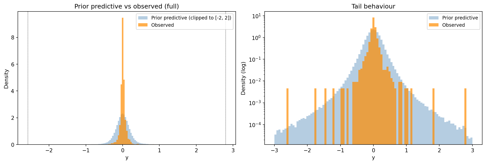
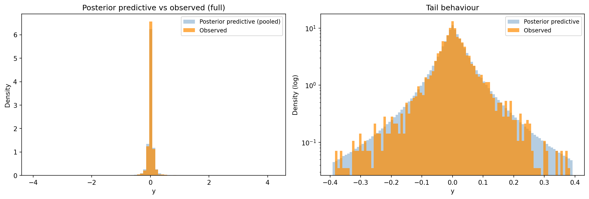
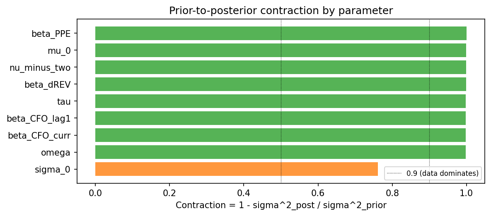
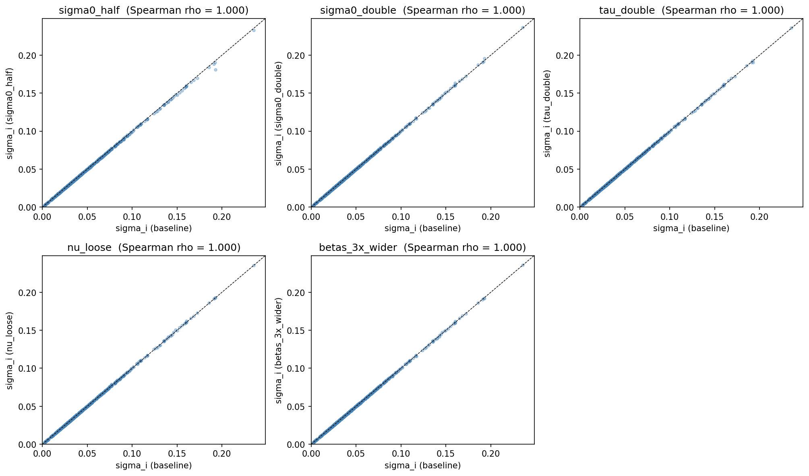

# HB accrual model -- diagnostics, portfolio year 2024

- **input_csv**: results/extraction_static/prepared_step2_input.csv
- **portfolio_year**: 2024
- **n_firms_in_window**: 617
- **n_obs_in_window**: 3625
- **window_years**: 2019-2024
- **n_draws**: 2000
- **n_tune**: 4000
- **n_chains**: 4
- **sensitivity_grid**: basic
- **n_variants**: 6

## 1. Prior predictive check

Sampled observable values from the prior alone and compared to observed data.

| Statistic | Observed | Prior predictive |
|---|---|---|
| Min / Max | -2.580 / +2.802 | -- |
| Quantile 0.01% / 99.99% | -- | -2.139 / +2.127 |
| Quantile 2.5% / 97.5% | -0.192 / +0.198 | -0.421 / +0.430 |
| Std deviation | 0.131 | 0.221 |

Fraction of prior-predictive draws within the observed range: **100.0%**.  
Fraction with |y| > 1: **0.3%**.

## 2. Posterior predictive check

Sampled observable values from the posterior and compared to observed data. Bayesian p-values close to 0.5 indicate the model captures the corresponding test statistic; values near 0 or 1 indicate misfit.

| Statistic | Observed | Posterior pred. mean | Bayesian p |
|---|---|---|---|
| mean | +0.0056 | +0.0038 | 0.198 |
| std | +0.1307 | +0.1309 | 0.339 |
| skew | +0.5095 | -0.4081 | 0.339 |
| kurtosis | +133.3040 | +134.3145 | 0.208 |
| min | -2.5798 | -2.1646 | 0.799 |
| max | +2.8025 | +2.0518 | 0.150 |
| q05 | -0.1192 | -0.1399 | 0.001 |
| q95 | +0.1368 | +0.1527 | 0.991 |

_Based on 8000 posterior predictive replicates of 3625 observations each._

## 3. Prior-to-posterior contraction

Contraction = 1 - sigma^2_post / sigma^2_prior. Values near 1 mean the data dominated; values near 0 mean the prior dominated.

| parameter | prior_dist | prior_sd | posterior_mean | posterior_sd | contraction |
|---|---|---|---|---|---|
| beta_PPE | Normal | 0.3000 | -0.0004 | 0.0020 | 1.0000 |
| mu_0 | Normal | 0.1000 | 0.0028 | 0.0015 | 0.9998 |
| nu_minus_two | Exponential | 10.0000 | 0.7351 | 0.1849 | 0.9997 |
| beta_dREV | Normal | 0.3000 | 0.0879 | 0.0063 | 0.9996 |
| tau | HalfNormal | 0.0301 | 0.0071 | 0.0011 | 0.9986 |
| beta_CFO_lag1 | Normal | 0.3000 | 0.2692 | 0.0134 | 0.9980 |
| beta_CFO_curr | Normal | 0.3000 | -0.3059 | 0.0138 | 0.9979 |
| omega | HalfNormal | 0.0301 | 0.0024 | 0.0014 | 0.9978 |
| sigma_0 | HalfNormal | 0.0301 | 0.0669 | 0.0147 | 0.7619 |

## 4. Sensitivity to alternative priors

Comparison of posterior mean of the target quantity across prior variants.

### Pairwise summary (vs baseline)

| variant | vs_baseline | median_abs_diff | p95_abs_diff | median_rel_diff_pct | p95_rel_diff_pct | spearman_rho |
|---|---|---|---|---|---|---|
| sigma0_half | baseline | 0.0002 | 0.0010 | 0.5044 | 1.4342 | 0.9999 |
| sigma0_double | baseline | 0.0001 | 0.0006 | 0.4212 | 1.2514 | 0.9999 |
| tau_double | baseline | 0.0001 | 0.0006 | 0.3646 | 1.2724 | 0.9999 |
| nu_loose | baseline | 0.0002 | 0.0006 | 0.3982 | 1.2420 | 0.9999 |
| betas_3x_wider | baseline | 0.0001 | 0.0006 | 0.3989 | 1.1370 | 0.9999 |

### Rank correlations

|  | baseline | sigma0_half | sigma0_double | tau_double | nu_loose | betas_3x_wider |
|---|---|---|---|---|---|---|
| baseline | 1.0000 | 0.9999 | 0.9999 | 0.9999 | 0.9999 | 0.9999 |
| sigma0_half | 0.9999 | 1.0000 | 0.9999 | 0.9999 | 0.9999 | 0.9999 |
| sigma0_double | 0.9999 | 0.9999 | 1.0000 | 0.9999 | 0.9999 | 0.9999 |
| tau_double | 0.9999 | 0.9999 | 0.9999 | 1.0000 | 0.9999 | 0.9999 |
| nu_loose | 0.9999 | 0.9999 | 0.9999 | 0.9999 | 1.0000 | 0.9999 |
| betas_3x_wider | 0.9999 | 0.9999 | 0.9999 | 0.9999 | 0.9999 | 1.0000 |

